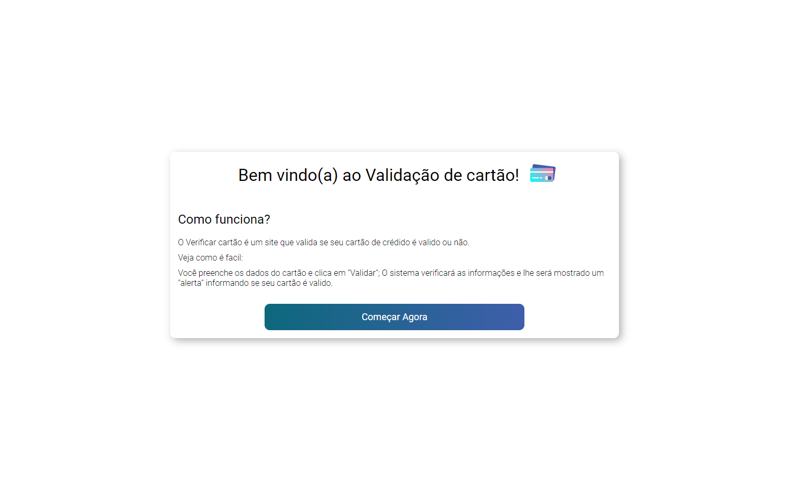
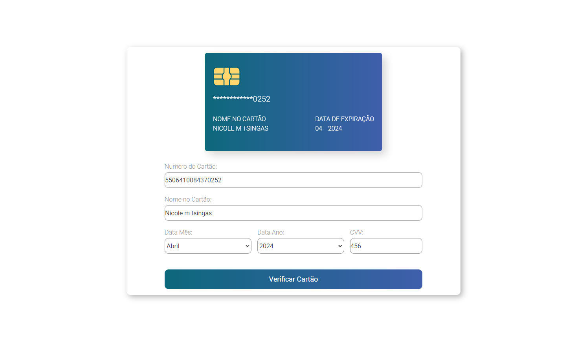

# Validador de Cartão de Crédito
> SAP-010 Laboratoria

Projeto criado para o bootcamp laboratoria turma 10, onde o usuario consegue validar seu cartão de crédito.

## Sobre o projeto
O objetivo deste projeto é criar uma interface onde o usuario consiga validar se o número do seu cartão de crédito é válido ou não para assim conseguir realizar suas compras.

## Como funciona?
Ao acessar o link do projeto o usuário visualizará a index.html que contém uma explicação sobre como validar seu cartão. Após clicar no botão de começar, o usuário será direcionado a página de formulário onde deve inserir os dados de seu cartão, tais como: Número do cartão, nome no cartão, CVV e data de expiração. Após inserir as informações e clicar no botão "Verificar Cartão" será verificado o número informado e retornará um "Alert" informando se o cartão é válido ou não.
 
 

> Lógica de Validar Cartão

A lógica utillizada para validar cartão foi "O algoritmo de Luhn"; Onde este pega os números do cartão informado, dobra os números de cada segundo digito (contando da direita para esquerda) e dobra seu valor.  Se o resultado dessa multiplicação for maior que o numero 9 ( por exemplo 16) este mesmo numero é divido em dois numeros diferentes e os soma (1 + 6 = 7) e so então soma todos os numeros do cartão. Se o resultado da soma terminar com 0 (ex: 80, 20, 40, 60) é um cartão válido, se não, será inválido.

### 📎[Acesse aqui]()

 

 

## 🛠 Tecnologias Utilizadas

- HTML

- CSS

- JavaScript

- Git e Github

 
 

## ✨Contato

nick_monalisa@outlook.com